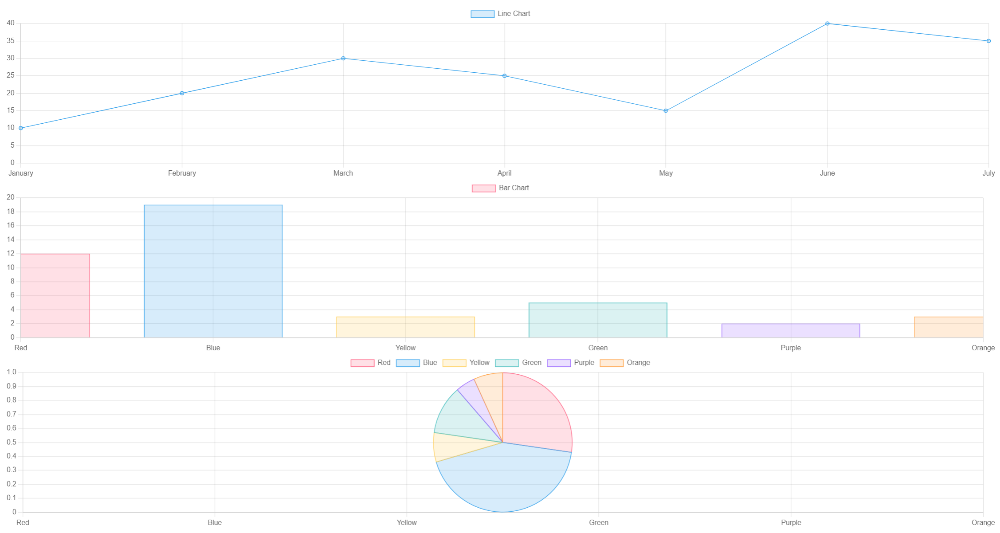

# Chart.js

## 1. Which package/library does the sample program demonstrate?

  The sample program demonstrates the usage of Chart.js, a JavaScript library for creating interactive and customizable charts and graphs on web pages.

## 2. How does someone run your program?

  To run the program, you can follow these steps:

  1. Download the provided chart.html file.
  2. Open the HTML file in a web browser.

## 3. What purpose does your program serve?

  The program serves to demonstrate how to create a simple line chart using Chart.js. It showcases the basic structure of using Chart.js to render a chart on a web page with some sample data.

## 4. What would be some sample input/output?

### Sample Input:
```javascript
// Sample data for line chart
const lineChartData = {
  labels: ['January', 'February', 'March', 'April', 'May', 'June', 'July'],
  datasets: [{
    label: 'Line Chart',
    data: [10, 20, 30, 25, 15, 40, 35], // Sample values
    backgroundColor: 'rgba(54, 162, 235, 0.2)', // Background color
    borderColor: 'rgba(54, 162, 235, 1)', // Border color
    borderWidth: 1 // Border width
  }]
};

// Sample data for bar chart
const barChartData = {
  labels: ['Red', 'Blue', 'Yellow', 'Green', 'Purple', 'Orange'],
  datasets: [{
    label: 'Bar Chart',
    data: [12, 19, 3, 5, 2, 3], // Sample values
    backgroundColor: [
      'rgba(255, 99, 132, 0.2)',
      'rgba(54, 162, 235, 0.2)',
      'rgba(255, 206, 86, 0.2)',
      'rgba(75, 192, 192, 0.2)',
      'rgba(153, 102, 255, 0.2)',
      'rgba(255, 159, 64, 0.2)'
    ],
    borderColor: [
      'rgba(255, 99, 132, 1)',
      'rgba(54, 162, 235, 1)',
      'rgba(255, 206, 86, 1)',
      'rgba(75, 192, 192, 1)',
      'rgba(153, 102, 255, 1)',
      'rgba(255, 159, 64, 1)'
    ],
    borderWidth: 1 // Border width
  }]
};

// Sample data for pie chart
const pieChartData = {
  labels: ['Red', 'Blue', 'Yellow', 'Green', 'Purple', 'Orange'],
  datasets: [{
    label: 'Pie Chart',
    data: [12, 19, 3, 5, 2, 3], // Sample values
    backgroundColor: [
      'rgba(255, 99, 132, 0.2)',
      'rgba(54, 162, 235, 0.2)',
      'rgba(255, 206, 86, 0.2)',
      'rgba(75, 192, 192, 0.2)',
      'rgba(153, 102, 255, 0.2)',
      'rgba(255, 159, 64, 0.2)'
    ],
    borderColor: [
      'rgba(255, 99, 132, 1)',
      'rgba(54, 162, 235, 1)',
      'rgba(255, 206, 86, 1)',
      'rgba(75, 192, 192, 1)',
      'rgba(153, 102, 255, 1)',
      'rgba(255, 159, 64, 1)'
    ],
    borderWidth: 1 // Border width
  }]
};
```
### Sample Output:

  Here is the output from the above sample input:
  